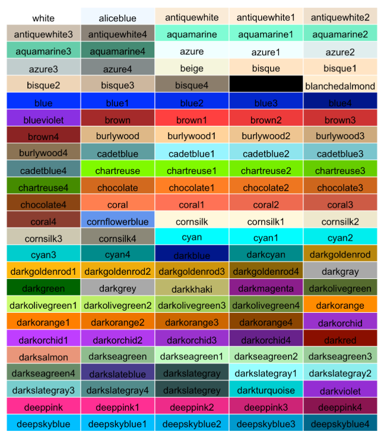

```{r setup, include=FALSE}
knitr::opts_chunk$set(echo = TRUE)
```
What do # mean? Can remove from chunks if miss steps, otherwise can write along in own chunk. 
have a "follow along" type and a "run only" type 

# Doing calculations 
```{r}
x <- 3 + 7
print(x)
```

# Doing harder math: multi-step equations
Solve this equation: 3*(x-4)= 2*(-2x+1)
1. simplify by hand:    
      3x-(3*4) = -4x +2
      3x+4x = 14
      7x = 14
2. here, a and b are coefficients (a = 7 and b =14)
3. enter these values as variables in R 
4. use coefficeitns to solve for x
      
```{r}
#simplified equation: 7x=14
a <- 7
b <- 14

x = b/a
print(x)

```

Now try another equation: -15x +21 +5x =-19
This one is a little easier, we only have to get all the integrers on one side and all the x's on one side
Simplified Equation: -10x = -40

```{r}
a <- -10
b <- -40
x <- b/a 
print(x)
```

# Making a Table 
vector is a list. talk about how to make a list using c() and " " 
```{r}
vegetables <- c("corn", "beans", "squash")
wk_after_frost <- c("2", "1", "2")
garden <- data.frame(vegetables, wk_after_frost)
View(garden)
```
# Creating data to graph 
```{r}
x <- c(1, 2, 3, 4, 5, 6, 7, 8, 9)
y <- c(0.75, 1.0, 1.5, 2.0, 2.25, 3.0, 4, 3.75, 5.0)
```

# Types of graph R can make
Discuss dependent and independent variables 

x and y: the coordinates of points to plot
type : the type of graph to create; Possible values are :
type=“p”: for points (by default)
type=“l”: for lines
type=“b”: for both; points are connected by a line
type=“o”: for both ‘overplotted’;
type=“h”: for ‘histogram’ like vertical lines
type=“s”: for stair steps
type=“n”: for no plotting

```{r}
plot(x, y, type= "s")
```

# base R comes with some data! 
Here is a link to find a data set we want to work with: https://stat.ethz.ch/R-manual/R-devel/library/datasets/html/00Index.html

# Example with a data set.
warpbreaks package could be interesting
Does the amount of tension used in weaving cause more yarn breakages? 
introduce $ for calling a variable in df. 

```{r}
View(warpbreaks)
plot(x= warpbreaks$tension, y = warpbreaks$breaks)

```
Does wool type make more difference in breaks?
```{r}
plot(x=warpbreaks$wool, y = warpbreaks$breaks)
```
What are some other factors that could make a difference? 

# Data with categories 
this works, but also trying to make a histogram 
```{r}
species <- as.factor(iris$Species)
lengths <- iris$Sepal.Length

plot(species, lengths)
```

# Hair and Eye Color Example
Start by just a histogram of males vs females in the class
This example has a lot of new subetting and formatting. Might not be the ideal example. 

```{r}
plot(as.factor(HairEyeColor$Sex))
```
Oh no! we got an error because this is an atomic vector! What is the class of data? 
```{r}
class(HairEyeColor)
```
A table! In order to use $ operator we need a dataframe
```{r}
HairEyeColor_df <- as.data.frame(HairEyeColor)
```
Looks like good sampling, there are the same amount of males and females. Now let's see the breakdown of eye color. 
```{r}
plot(x= as.factor(HairEyeColor_df$Sex), y = HairEyeColor_df$Eye)
```

Simple plots of distribution of hair and eye color independently 
```{r}
plot(x= HairEyeColor_df$Hair, y = HairEyeColor_df$Freq)
plot(x= HairEyeColor_df$Eye, y = HairEyeColor_df$Freq)
```
What if I want to explore the frequency of each combination of hair and eye color? 
```{r}
combined_factor <- interaction(HairEyeColor_df$Hair, HairEyeColor_df$Eye)
```
make a graphic of these data 
```{r}
barplot(HairEyeColor_df$Freq, names.arg = combined_factor, las = 2, 
        xlab = "Hair and Eye Color Combo", ylab = "Frequency",
        main = "Frequency of Hair and Eye Color Combinations", col = "lightblue")
```

What if we want to know how much of each combination is male vs. female?
```{r}
freq_matrix <- xtabs(Freq ~ combined_factor + Sex, data = HairEyeColor_df)
combined_labels <- paste(rep(levels(combined_factor), each = 2), c("Male", "Female"), sep = "-")

barplot(freq_matrix, beside = TRUE, col = c("green", "purple"),
        names.arg = combined_labels, las =2,  
        xlab = "Hair and Eye Color Combo", ylab = "Frequency",
        main = "Frequency of Hair and Eye Color Combinations")

```
what combination is the most popular (has highest frequency) in both males and females 
```{r}
max_freq <- max(HairEyeColor_df$Freq)
max_freq_row <- HairEyeColor_df[which.max(HairEyeColor_df$Freq),]
print(max_freq_row)
#Let's rename this max since it's the max females 
max_female_combo <- max_freq_row
```
Okay, so that's the most popular combination for females, let's see the frequency of that combination in males. 
First we'll choose only males 
```{r}
max_male_combo <-subset(HairEyeColor_df, Hair == "Brown" & Eye == "Brown"& Sex == "Male")
```
We can combine these into a new df 
```{r}
max_combos <- rbind(max_female_combo, max_male_combo)
plot(x= as.factor(max_combos$Sex), y= max_combos$Freq)
```

Now let's try it again 
```{r}
plot(as.factor(HairEyeColor_df$Sex), y = HairEyeColor_df$Freq)
```


# a pretty plot with base R 
graph set up 
```{r}
x <- 1:100
y <- (rnorm(100, sd = 15) + x + 100) / 10
group <- c(rep("A", 50), rep("B", 50))

k_purple <- "#875692"
k_orange <- "#F38400"
colors <- c(A = k_purple, B = k_orange)
```

A base R plot 
```{r}
plot(x,y)
```



A prettier plot in Base R 
```{r}
plot (x, y, 
      bty = "n", # remove box
      pch = 20,
      cex = 1.4,
      col = colors[group]
      ) 

```


